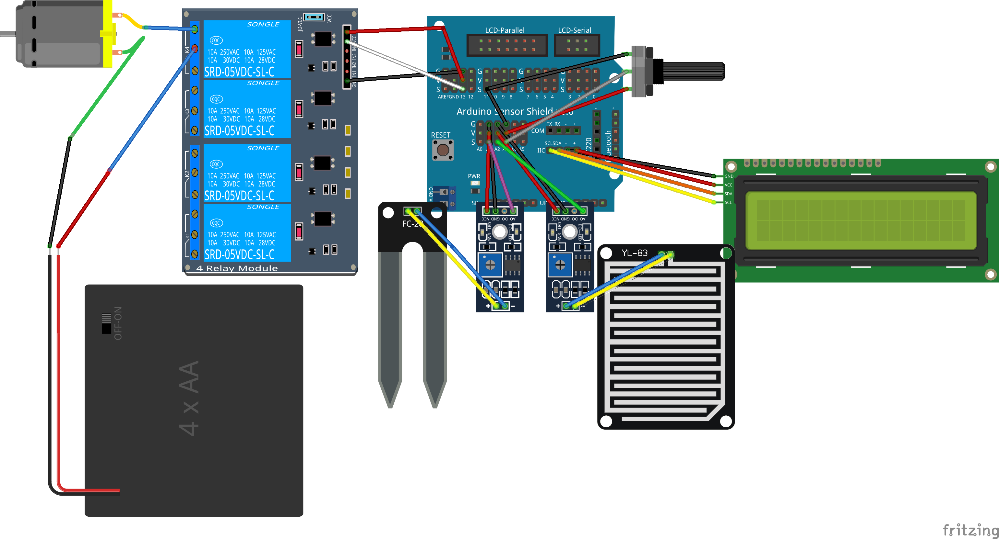

# SmartCities Huerto

## Huerto inteligente

Sistema de riego/invernadero inteligente que puede recuperar las predicciones atmosféricas así como compartir los datos meteorológicos y de consumo de agua.
  * Control local/remoto de riego según las condiciones atmosféricas
  * Medida de humedad y otros parámetros
  * Control de válvulas de riego o de electrobomba

Incluirá los siguientes sensores y actuadores
  * Luz
  * Temperatura
  * Humedad
  * Lluvia
  * Humedad del suelo
  * Placa de relés (para las electrobombas o electroválvulas)

Estará conectado a Internet permitiendo enviar los datos y recabar predicciones del tiempo para así decidir cuando regar y la cantidad de riego necesaria.

### Base

Control local/remoto de riego según las condiciones atmosféricas

#### Materiales
* Controlador
* Sensores
  * luz
  * temperatura
  * humedad
  * humedad del suelo
  * lluvia
* Wifi
* Placa de reles (para las electrobombas o electroválvulas)
* Electrobombas o Electroválvulas
* Alimentación
* Cables

#### Ejemplo

Control de invernadero

## Maqueta  Sistema de riego/invernadero
* Medida de humedad
* Control de válvulas de riego o de electrobomba

## Ejemplos

## Control riego  

Se trata de un sistema de control de riego que decide si activarse o no en función de la lectura de un sensor de humedad del suelo y de otro sensor de lluvia

Ejemplo: SmartCities/Riego/Control_riego

## Publicación de los datos de riego  ([ThingSpeak](https://github.com/javacasm/SmartCities_Comunes/blob/master/ThingSpeak.md)

Utilizamos el montaje anterior como fuente de datos que se publicarán en [ThingSpeak](https://github.com/javacasm/SmartCities_Comunes/blob/master/ThingSpeak.md)

Ejemplo: SmartCities/Riego/Publicacion_riego

## Publicación y control remoto (MQTT)

Utilizamos el montaje anterior como fuente de datos que se publicarán en [MQTT](https://github.com/javacasm/SmartCities_Comunes/blob/master/mqtt.md)

Se envían datos desde el servidor para controlar remotamente el riego

Ejemplo: SmartCities/Riego/Publicacion_y_control_remoto

## [Referencias](./Referencias.md)
